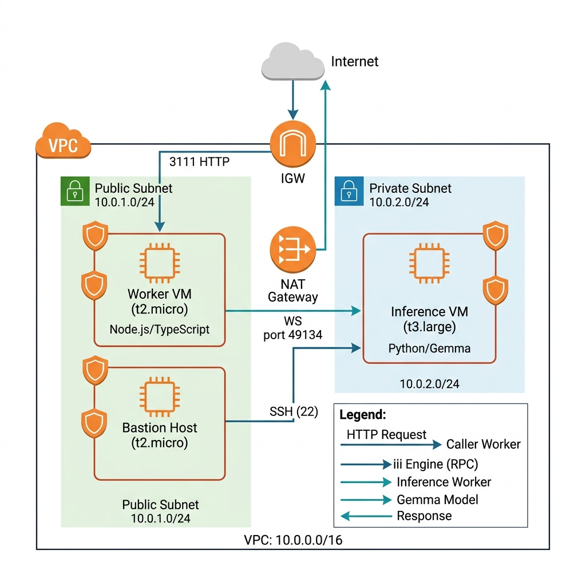
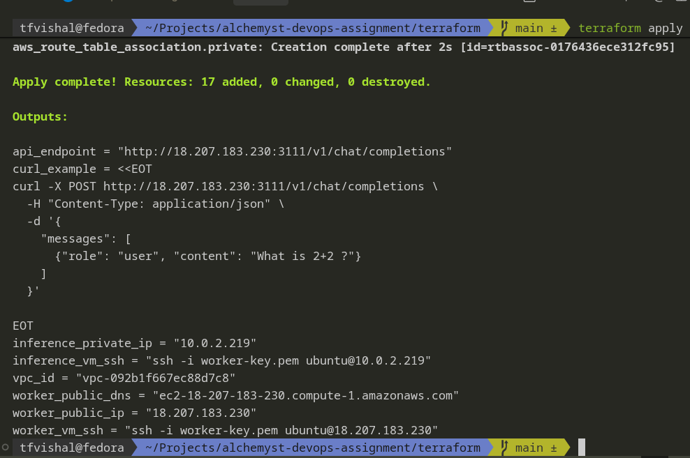
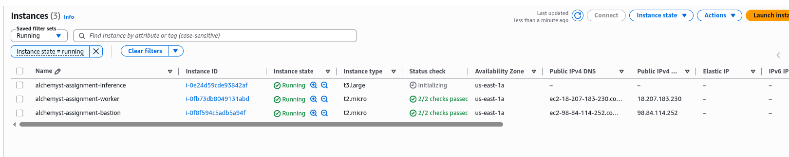
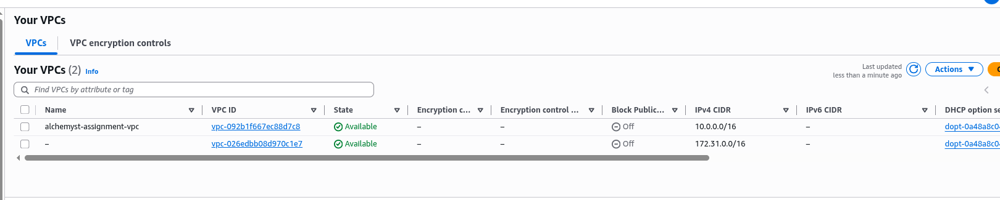

# 🚀 Scalable Inference Architecture on AWS

A production-grade infrastructure prototype that deploys a distributed language model inference system across multiple EC2 instances using Terraform. A Python worker hosts Google's Gemma-3 model and exposes inference as an RPC function; a TypeScript worker fans incoming HTTP requests into that RPC and returns the result as JSON — all orchestrated by the [iii RPC engine](https://iii.dev/docs/).

> **📌 Project Status:** The AWS infrastructure has been **successfully provisioned and validated** (17 resources, all healthy). The iii RPC engine starts correctly and binds to the expected ports. However, the end-to-end inference pipeline is **not yet fully operational** due to application-level worker connectivity issues between the caller and inference workers. See [Known Issues](#-known-issues--debugging-log) for full details.

---

## 📋 Project Overview

### What This Project Does

This project provisions a **two-tier distributed inference architecture** on AWS where:

1. **API Tier (Worker VM)** — A public-facing EC2 instance runs the iii RPC engine with a TypeScript caller-worker that exposes an OpenAI-compatible HTTP API endpoint (`POST /v1/chat/completions`).
2. **Inference Tier (Inference VM)** — A private EC2 instance runs a Python inference-worker that loads Google's `gemma-3-270m` model and performs text generation via the `transformers` library.

The two workers communicate over WebSocket (port 49134) through the iii RPC engine, enabling **language-agnostic, cross-VM function calls**. This means you can scale the inference tier independently of the API tier.

### AWS Services Used

| Service              | Purpose                                              |
| -------------------- | ---------------------------------------------------- |
| **Amazon VPC**       | Isolated network with public/private subnets         |
| **Amazon EC2**       | Compute instances for worker, inference, and bastion |
| **Internet Gateway** | Public internet access for the worker VM             |
| **NAT Gateway**      | Outbound internet for the private inference VM       |
| **Elastic IP**       | Static IP for the NAT gateway                        |
| **Security Groups**  | Firewall rules for each instance tier                |
| **Key Pairs**        | SSH authentication for all instances                 |

### Current Status

| Component            | Status         | Notes                                                      |
| -------------------- | -------------- | ---------------------------------------------------------- |
| VPC & Networking     | ✅ Operational | All 17 resources provisioned successfully                  |
| Worker VM (Caller)   | ✅ Running     | iii engine starts, API binds to `0.0.0.0:3111`             |
| Inference VM         | ✅ Running     | Instance healthy, user_data executes                       |
| Bastion Host         | ✅ Running     | SSH jump box accessible                                    |
| HTTP API Endpoint    | ⚠️ Partial     | Port reachable, but returns empty response                 |
| End-to-End Inference | ❌ Not Working | Inference worker not registering RPC functions with engine |

---

## 🏗 Architecture

### Architecture Diagram



### Instance Roles

| Instance         | Subnet  | Role                     | Description                                                                                                                                                                            |
| ---------------- | ------- | ------------------------ | -------------------------------------------------------------------------------------------------------------------------------------------------------------------------------------- |
| **Worker VM**    | Public  | API Gateway + RPC Engine | Runs the iii engine which hosts the HTTP API (port 3111) and the WebSocket RPC bus (port 49134). The TypeScript caller-worker receives HTTP requests and forwards them as RPC calls.   |
| **Inference VM** | Private | Model Host               | Runs the Python inference-worker which loads the Gemma-3 language model and registers `inference::run_inference` as an RPC function. Connects to the Worker VM's engine via WebSocket. |
| **Bastion Host** | Public  | SSH Jump Box             | Provides secure SSH access to the private Inference VM. Only accessible from the operator's IP address.                                                                                |

### Request Flow

```
Client HTTP POST → Worker VM :3111
  → iii HTTP Worker (routes request)
    → caller-worker: inference::get_response()
      → RPC over WebSocket :49134
        → Inference VM: inference::run_inference()
          → Gemma-3 model generates text
        ← Returns generated text
      ← Returns RPC result
    ← Returns JSON response
  ← HTTP 200 JSON
```

---

## 🔧 Infrastructure Components

### 1. VPC (Virtual Private Cloud)

```hcl
CIDR Block: 10.0.0.0/16
DNS Hostnames: Enabled
DNS Support: Enabled
```

The VPC provides an isolated network environment for all resources. DNS hostnames are enabled to allow EC2 instances to resolve each other by hostname.

### 2. Subnets

| Subnet  | CIDR          | Type                           | Purpose                 |
| ------- | ------------- | ------------------------------ | ----------------------- |
| Public  | `10.0.1.0/24` | Public (auto-assign public IP) | Worker VM, Bastion Host |
| Private | `10.0.2.0/24` | Private (no public IP)         | Inference VM            |

Both subnets are deployed in `us-east-1a` for simplicity.

### 3. Internet Gateway & NAT Gateway

- **Internet Gateway** — Attached to the VPC, enables public subnet instances to communicate with the internet.
- **NAT Gateway** — Deployed in the public subnet with an Elastic IP. Allows the private inference VM to pull packages and dependencies without being directly exposed to the internet.

### 4. Route Tables

| Route Table | Destination | Target           | Associated Subnet |
| ----------- | ----------- | ---------------- | ----------------- |
| Public      | `0.0.0.0/0` | Internet Gateway | Public Subnet     |
| Private     | `0.0.0.0/0` | NAT Gateway      | Private Subnet    |

### 5. Security Groups

#### Worker Security Group

| Rule    | Port  | Protocol | Source              | Purpose                         |
| ------- | ----- | -------- | ------------------- | ------------------------------- |
| Ingress | 22    | TCP      | Operator IP (`/32`) | SSH access                      |
| Ingress | 3111  | TCP      | `0.0.0.0/0`         | HTTP API endpoint               |
| Ingress | 49134 | TCP      | `10.0.2.0/24`       | WebSocket RPC from inference VM |
| Egress  | All   | All      | `0.0.0.0/0`         | Outbound traffic                |

#### Inference Security Group

| Rule    | Port  | Protocol | Source      | Purpose                    |
| ------- | ----- | -------- | ----------- | -------------------------- |
| Ingress | 22    | TCP      | Bastion SG  | SSH via bastion only       |
| Ingress | 49134 | TCP      | Worker SG   | WebSocket RPC from engine  |
| Egress  | All   | All      | `0.0.0.0/0` | Outbound traffic (via NAT) |

#### Bastion Security Group

| Rule    | Port | Protocol | Source              | Purpose          |
| ------- | ---- | -------- | ------------------- | ---------------- |
| Ingress | 22   | TCP      | Operator IP (`/32`) | SSH access       |
| Egress  | All  | All      | `0.0.0.0/0`         | Outbound traffic |

### 6. EC2 Instances

| Instance  | Type       | AMI              | Subnet  | Storage   | User Data      |
| --------- | ---------- | ---------------- | ------- | --------- | -------------- |
| Worker    | `t2.micro` | Ubuntu 22.04 LTS | Public  | 20 GB gp3 | `worker.sh`    |
| Inference | `t3.large` | Ubuntu 22.04 LTS | Private | 20 GB gp3 | `inference.sh` |
| Bastion   | `t2.micro` | Ubuntu 22.04 LTS | Public  | 8 GB gp3  | None           |

---

## 👷 Worker Architecture

### Caller Worker (TypeScript)

| Property  | Value                                                      |
| --------- | ---------------------------------------------------------- |
| Language  | TypeScript (Node.js 20.x)                                  |
| Runner    | `tsx watch` (hot-reload)                                   |
| SDK       | `iii-sdk ^0.12.0`                                          |
| Functions | `inference::get_response`, `http::run_inference_over_http` |

The caller-worker registers an HTTP trigger on `POST /v1/chat/completions` that accepts an OpenAI-compatible chat completion request and delegates the actual inference to the Python worker via RPC.

### Inference Worker (Python)

| Property  | Value                                         |
| --------- | --------------------------------------------- |
| Language  | Python 3                                      |
| Model     | `gemma-3-270m` (GGUF, Q8 quantized)           |
| Libraries | `transformers`, `torch`, `gguf`, `accelerate` |
| SDK       | `iii-sdk >=0.12.0`                            |
| Function  | `inference::run_inference`                    |

The inference-worker loads the Gemma model, applies the chat template to incoming messages, runs generation, and returns the decoded output.

---

## 📖 Step-by-Step Deployment Process

This section explains what Terraform creates and **why** each component is needed.

### Step 1: Create the VPC

**Why:** A VPC provides an isolated virtual network. Without it, resources would share the default AWS network with no logical separation.

```
VPC CIDR: 10.0.0.0/16 → Provides 65,536 IP addresses
```

### Step 2: Create Subnets

**Why:** Subnets segment the network. The public subnet hosts internet-facing services; the private subnet isolates the inference engine from direct internet exposure — a security best practice.

- **Public Subnet** (`10.0.1.0/24`) — 256 IPs, auto-assigns public IPs
- **Private Subnet** (`10.0.2.0/24`) — 256 IPs, no public IPs

### Step 3: Create Internet Gateway

**Why:** Without an IGW, nothing in the VPC can reach the internet. The worker VM needs to be publicly accessible to serve the HTTP API.

### Step 4: Configure Route Tables

**Why:** Route tables control traffic flow. The public route table sends internet-bound traffic through the IGW; the private route table sends it through the NAT gateway.

### Step 5: Create NAT Gateway + Elastic IP

**Why:** The inference VM sits in a private subnet with no public IP. It still needs outbound internet access to download Python packages, the model, and updates. The NAT gateway provides this without exposing the VM inbound.

### Step 6: Create Security Groups

**Why:** Security groups act as virtual firewalls. Each instance gets the minimum required access:

- Worker: HTTP API + SSH + RPC from inference subnet
- Inference: SSH from bastion only + RPC from worker
- Bastion: SSH from operator IP only

### Step 7: Create Key Pair

**Why:** EC2 instances use SSH key pairs for authentication instead of passwords. The `worker-key.pub` is uploaded to AWS and associated with all instances.

### Step 8: Launch EC2 Instances

**Why:** These are the compute resources that run the application.

- Worker VM launches first (inference depends on its private IP)
- Inference VM launches second with the worker's IP injected into its boot script
- Bastion launches independently

### Step 9: User Data Execution

**Why:** User data scripts run automatically on first boot via `cloud-init`. They install dependencies, clone the repo, configure systemd services, and start the application — enabling a fully automated, hands-off deployment.

### Step 10: Validation

After `terraform apply` completes, wait 3–5 minutes for cloud-init to finish, then test:

```bash
# Check if the API port is reachable
curl -s http://<worker_public_ip>:3111/v1/chat/completions

# SSH into the worker to check services
ssh -i worker-key ubuntu@<worker_public_ip>
sudo systemctl status iii-engine
sudo journalctl -u iii-engine -f
```

---

## 🛠 Terraform Deployment Instructions

### Prerequisites

| Tool         | Version | Installation                                                                               |
| ------------ | ------- | ------------------------------------------------------------------------------------------ |
| Terraform    | ≥ 1.5   | [terraform.io/downloads](https://developer.hashicorp.com/terraform/downloads)              |
| AWS CLI      | v2      | [docs.aws.amazon.com](https://docs.aws.amazon.com/cli/latest/userguide/install-cliv2.html) |
| SSH Key Pair | —       | Pre-generated `worker-key` and `worker-key.pub` in `terraform/`                            |

### AWS CLI Configuration

```bash
aws configure
# AWS Access Key ID: <your-access-key>
# AWS Secret Access Key: <your-secret-key>
# Default region: us-east-1
# Default output format: json
```

### Deploy

```bash
# 1. Clone the repository
git clone https://github.com/tf-vishal/scalable-inference-architecture.git
cd scalable-inference-architecture/terraform

# 2. Generate an SSH key pair (if not already present)
ssh-keygen -t ed25519 -f worker-key -N ""

# 3. Initialize Terraform (downloads AWS provider)
terraform init

# 4. Validate configuration syntax
terraform validate
# Expected: Success! The configuration is valid.

# 5. Preview the execution plan
terraform plan
# Expected: Plan: 17 to add, 0 to change, 0 to destroy.

# 6. Apply the infrastructure
terraform apply
# Type 'yes' when prompted
# Expected: Apply complete! Resources: 17 added, 0 changed, 0 destroyed.

# 7. Note the outputs
terraform output
```

### Customizing Variables

Override defaults by creating a `terraform.tfvars` file:

```hcl
aws_region            = "us-east-1"
vpc_cidr              = "10.0.0.0/16"
public_subnet_cidr    = "10.0.1.0/24"
private_subnet_cidr   = "10.0.2.0/24"
worker_instance_type  = "t2.micro"
instance_type_inference = "t3.large"
bastion_instance_type = "t2.micro"
home_ip               = "YOUR_PUBLIC_IP/32"   # Replace with your IP
http_port             = 3111
ws_port               = 49134
```

### Tear Down

```bash
terraform destroy
# Type 'yes' when prompted
# Expected: Destroy complete! Resources: 17 destroyed.
```

---

## 🌐 API Usage

### Endpoint

```
POST http://<worker_public_ip>:3111/v1/chat/completions
Content-Type: application/json
```

> ⚠️ **Note:** This endpoint is currently reachable (port open, engine running) but does not return inference results due to the inference worker not being fully connected. See [Known Issues](#-known-issues--debugging-log).

### Request Example

```bash
curl -X POST http://<worker_public_ip>:3111/v1/chat/completions \
  -H "Content-Type: application/json" \
  -d '{
    "messages": [
      {"role": "user", "content": "What is 2+2 ?"}
    ]
  }'
```

### Expected Response (When Fully Operational)

```json
{
  "response": "2 + 2 = 4"
}
```

### Authentication

No authentication is currently implemented. The API is open on port 3111 to all IP addresses (`0.0.0.0/0`).

---

## 📜 User Data Scripts

Both EC2 instances use `templatefile()` to inject Terraform variables into shell scripts that execute on first boot via cloud-init.

### Worker VM (`worker.sh`)

| Step | Action                                              | Purpose                                                                        |
| ---- | --------------------------------------------------- | ------------------------------------------------------------------------------ |
| 1    | Install system packages (`git`, `curl`, `jq`, etc.) | Base dependencies                                                              |
| 2    | Install Node.js 20.x LTS                            | Runtime for TypeScript caller-worker                                           |
| 3    | Install iii CLI v0.12.0                             | RPC engine binary                                                              |
| 4    | Clone project repository                            | Get worker source code                                                         |
| 5    | `npm install` in caller-worker directory            | Install Node.js dependencies                                                   |
| 6    | Write `config.yaml`                                 | Configure iii engine with HTTP, queue, state, observability, and caller-worker |
| 7    | Create `iii-engine.service` systemd unit            | Auto-start engine on boot                                                      |
| 8    | Enable and start the engine                         | Begin serving immediately                                                      |

**Template Variables Injected:**

- `${http_port}` → `3111` (HTTP API port)
- `${ws_port}` → `49134` (WebSocket RPC port — used by config implicitly)

### Inference VM (`inference.sh`)

| Step | Action                                                          | Purpose                                                             |
| ---- | --------------------------------------------------------------- | ------------------------------------------------------------------- |
| 1    | Install system packages (`python3`, `python3-venv`, `jq`, etc.) | Base dependencies                                                   |
| 2    | Clone project repository                                        | Get worker source code                                              |
| 3    | Create Python virtualenv and install dependencies               | Isolated Python environment with `transformers`, `torch`, `iii-sdk` |
| 4    | Create `inference-worker.service` systemd unit                  | Auto-start worker on boot                                           |
| 5    | Enable and start the worker                                     | Connect to remote engine                                            |

**Template Variables Injected:**

- `${worker_private_ip}` → Worker VM's private IP (e.g., `10.0.1.55`)
- `${ws_port}` → `49134` (WebSocket port to connect to engine)

**Key Design Decision:** The inference VM does **not** run its own iii engine. It connects directly to the Worker VM's engine via `III_URL=ws://<worker_private_ip>:49134`. This is the **single-engine architecture** required by iii v0.12.0.

---

## 🐛 Known Issues & Debugging Log

### Issue Summary

The infrastructure provisioning is **fully successful** — all 17 AWS resources are created, healthy, and correctly networked. The application-level issue is that the inference worker does not successfully register its RPC functions with the remote iii engine, resulting in the HTTP endpoint returning empty responses.

### Debugging Timeline

#### 1. iii CLI Installation Failure — Missing `jq`

**Symptom:** cloud-init failed with `error: jq is required`
**Root Cause:** The iii installer script requires `jq` for JSON parsing, which isn't installed by default on Ubuntu.
**Fix:** Added `jq` to the `apt-get install` command in both user data scripts.

```diff
- apt-get install -y git curl wget unzip
+ apt-get install -y git curl wget unzip jq
```

#### 2. GLIBC Version Mismatch

**Symptom:** `iii-worker: /lib/x86_64-linux-gnu/libc.so.6: version 'GLIBC_2.32' not found`
**Root Cause:** Ubuntu 20.04 (Focal) ships with GLIBC 2.31; the `iii-worker` binary requires GLIBC 2.32+.
**Fix:** Upgraded AMI filter from `ubuntu-focal-20.04` to `ubuntu-jammy-22.04`.

```diff
- values = ["ubuntu/images/hvm-ssd/ubuntu-focal-20.04-amd64-server-*"]
+ values = ["ubuntu/images/hvm-ssd/ubuntu-jammy-22.04-amd64-server-*"]
```

#### 3. API Bound to `127.0.0.1` Instead of `0.0.0.0`

**Symptom:** `curl: (7) Failed to connect to <ip> port 3111`
**Root Cause:** The iii HTTP worker's `host` config was set to localhost, making the API unreachable from outside.
**Fix:** Set `host: 0.0.0.0` in the iii-http worker config within `worker.sh`.

#### 4. `file()` vs `templatefile()` — Template Variables Not Interpolated

**Symptom:** Ports and IPs in systemd units were empty strings.
**Root Cause:** `worker.sh` was loaded with `file()` which reads raw content. Template variables like `${http_port}` were passed to the shell as-is (empty).
**Fix:** Changed to `templatefile()` and passed all required variables.

```diff
- user_data = file("${path.module}/scripts/worker.sh")
+ user_data = templatefile("${path.module}/scripts/worker.sh", {
+     http_port = var.http_port
+     ws_port   = var.ws_port
+ })
```

#### 5. Wrong Repository Path Structure

**Symptom:** `npm install` failed — directory not found.
**Root Cause:** Scripts referenced `quickstart/workers/caller-worker` but the actual repo structure is `workers/caller-worker`.
**Fix:** Updated all path references in both scripts.

#### 6. Single-Engine Architecture Requirement (iii v0.12.0)

**Symptom:** `function_not_found` error when caller tried to invoke `inference::run_inference`.
**Root Cause:** Running separate iii engines on each VM means the engines can't see each other's registered functions. Both workers must connect to the **same** engine.
**Fix:** Removed the local iii-engine from the inference VM. The inference worker connects directly to the caller VM's engine via `III_URL`.

#### 7. Caller Worker Service (Exit Code 127)

**Symptom:** `caller-worker.service` failing with `status=127/n/a` (command not found).
**Root Cause:** The old systemd unit referenced a `WorkingDirectory` with an unexpanded `$WORKER_DIR` variable.
**Fix:** Let the iii engine manage the caller-worker directly via `config.yaml` instead of a separate systemd service.

### Current Limitation

The iii engine starts successfully and binds to both ports (3111 HTTP, 49134 WebSocket). The caller-worker registers with the engine. However, the inference worker on the private subnet has not yet been confirmed to successfully connect and register `inference::run_inference`. This is an **application-level** issue related to worker SDK communication, not an infrastructure issue.

---

## 🔮 Future Improvements

### Application Fixes

- [ ] Debug inference worker RPC registration with the remote iii engine
- [ ] Add health check endpoints to verify worker connectivity
- [ ] Implement request timeout handling and error responses

### Infrastructure Enhancements

- [ ] Add an **Application Load Balancer** in front of the worker VM for SSL termination
- [ ] Deploy across **multiple Availability Zones** for high availability
- [ ] Use **Auto Scaling Groups** for the inference tier to handle variable load
- [ ] Add **CloudWatch alarms** for CPU, memory, and service health monitoring
- [ ] Implement **AWS Systems Manager** for patching and maintenance

### Security Hardening

- [ ] Add API authentication (API keys or JWT)
- [ ] Restrict HTTP port 3111 to known CIDR ranges or place behind ALB
- [ ] Enable **VPC Flow Logs** for network auditing
- [ ] Use **AWS Secrets Manager** for sensitive configuration
- [ ] Remove hardcoded `home_ip` default; require it as input

### CI/CD

- [ ] Add GitHub Actions workflow for `terraform plan` on PRs
- [ ] Automate `terraform apply` on merge to main
- [ ] Add infrastructure tests with `terratest`
- [ ] Implement blue-green deployments for zero-downtime updates

---

## 📸 Deployment Evidence

### Terraform Apply Output

The infrastructure was provisioned successfully with all 17 resources:

```
Apply complete! Resources: 17 added, 0 changed, 0 destroyed.

Outputs:

api_endpoint         = "http://18.207.183.230:3111/v1/chat/completions"
inference_private_ip = "10.0.2.219"
vpc_id               = "vpc-092b1f667ec88d7c8"
worker_public_ip     = "18.207.183.230"
```

### Resources Created

| #   | Resource                 | ID                           |
| --- | ------------------------ | ---------------------------- |
| 1   | VPC                      | `vpc-092b1f667ec88d7c8`      |
| 2   | Public Subnet            | `subnet-0c00e5830659dd5e8`   |
| 3   | Private Subnet           | `subnet-02bdec7697821da97`   |
| 4   | Internet Gateway         | `igw-0fb1ad243051a4bf9`      |
| 5   | NAT Gateway              | `nat-086cc1941149358a5`      |
| 6   | Elastic IP               | `eipalloc-0f5cf46c45a7ae238` |
| 7   | Public Route Table       | `rtb-07aad8771c85769b0`      |
| 8   | Private Route Table      | `rtb-0326182f3e900a53c`      |
| 9   | Public RT Association    | `rtbassoc-0841b3878e9e17296` |
| 10  | Private RT Association   | `rtbassoc-0176436ece312fc95` |
| 11  | Worker Security Group    | `sg-0d9be364ae9621c9d`       |
| 12  | Inference Security Group | `sg-061a6b4efc18427de`       |
| 13  | Bastion Security Group   | `sg-0c8fceda94542d73e`       |
| 14  | Key Pair                 | `worker-key`                 |
| 15  | Worker Instance          | `i-0fb73db8049131abd`        |
| 16  | Inference Instance       | `i-0e24d59cde93842af`        |
| 17  | Bastion Instance         | `i-0f8f594c5adb5a94f`        |

---

## 🖥 AWS Console Screenshots

### Terraform Apply — Successful Deployment


_Terraform apply completed with 17 resources added, 0 changed, 0 destroyed. All outputs displayed including API endpoint, SSH commands, and VPC ID._

---

### EC2 Instances — All Running


_All three EC2 instances in "Running" state: `alchemyst-assignment-inference` (t3.large, private), `alchemyst-assignment-worker` (t2.micro, public IP: 18.207.183.230), and `alchemyst-assignment-bastion` (t2.micro, public IP: 98.84.114.252)._

---

### VPC — Available


_Custom VPC `alchemyst-assignment-vpc` with CIDR block `10.0.0.0/16` in "Available" state._

---

## 🔗 References

- [iii Engine Documentation](https://iii.dev/docs/)
- [Terraform AWS Provider](https://registry.terraform.io/providers/hashicorp/aws/latest/docs)
- [Google Gemma-3 Model](https://huggingface.co/google/gemma-3-270m)
- [Ubuntu 22.04 LTS on AWS](https://cloud-images.ubuntu.com/locator/ec2/)
